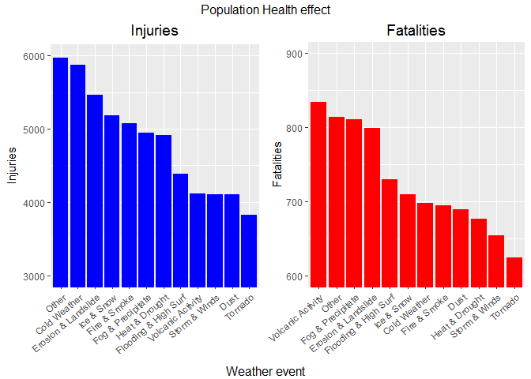
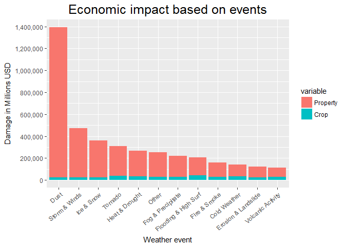

# Reproducible Research - Peer Assessment 2
Amir Azmi (https://github.com/amirmazmi/RepData_PeerAssessment2)  
April 10, 2017  


----  


## **Synopsis**

Storms and other severe weather events can cause both public health and economic problems for communities and municipalities. Many severe events can result in fatalities, injuries, and property damage, and preventing such outcomes to the extent possible is a key concern.

This project involves exploring the U.S. National Oceanic and Atmospheric Administration's (NOAA) storm database. This database tracks characteristics of major storms and weather events in the United States, including when and where they occur, as well as estimates of any fatalities, injuries, and property damage.  
<br>  
  
The main focus will be to answer the following questions:

1. Across the United States, which types of events (as indicated in the EVTYPE variable) are most harmful with respect to population health?
2. Across the United States, which types of events have the greatest economic consequences?

<br><br>  

----  

### **Quickjump**:

1. [Subsetting columns](#subsetcol)
2. [Subsetting rows](#subsetrows)
3. [Processing events](#events)
4. [Processing damage](#damage)
5. [Results](#results)
6. [Environment](#environment)


<br><br>  

----  

## **Source**

Below are links for the information used in this analysis:

1. [Data (bzip2/CSV)](https://d396qusza40orc.cloudfront.net/repdata%2Fdata%2FStormData.csv.bz2) 

2. [National Weather Service Storm Data Documentation (PDF)](https://d396qusza40orc.cloudfront.net/repdata%2Fpeer2_doc%2Fpd01016005curr.pdf)  

3. [National Climatic Data Center Storm Events FAQ (PDF)](https://d396qusza40orc.cloudfront.net/repdata%2Fpeer2_doc%2FNCDC%20Storm%20Events-FAQ%20Page.pdf)

<br><br>  

----  
<br><br>  


## **Data Processing**


The following packages are required. Here the library pacman will load the libraries if available and if not, install and load. 

```r
library(pacman)

p_load(R.utils, 
        xtable,
        data.table,
        lubridate,
        dplyr,
        ggplot2,
        gridExtra,
        scales)
```
<br>  
  
First get the data and load a few rows.  


```r
#check directory and create
setwd("F:/Coursera/05 Reproducible Research/Project/Wk 4/submission")
if ( !file.exists( "data" )) {
    dir.create ( "data" )
    }

targ_url <- "https://d396qusza40orc.cloudfront.net/repdata%2Fdata%2FStormData.csv.bz2"
downloadDate <- "Mon Apr 10 14.57.02 2017" #gsub(":",".",date())
destfile <- paste0("./data/storm-data",downloadDate,".bz2" )
decofile <- paste0("./data/storm-data",downloadDate,".csv" )

# if file does not exist, get it
if( !file.exists(destfile)){
    download.file( targ_url, destfile=destfile, method="curl")
    }

# if uncompressed, liberate it
if( !file.exists(decofile)){
    bunzip2( destfile, decofile, remove=F, skip=T )
}


df <- fread(decofile, header = TRUE, nrows=5000)
```

Data was downloaded on Mon Apr 10 14.57.02 2017.  

<br><br>

### Subsetting columns {#subsetcols}

Begin by inspecting the column names.


```r
names(df)
```

```
##  [1] "STATE__"    "BGN_DATE"   "BGN_TIME"   "TIME_ZONE"  "COUNTY"    
##  [6] "COUNTYNAME" "STATE"      "EVTYPE"     "BGN_RANGE"  "BGN_AZI"   
## [11] "BGN_LOCATI" "END_DATE"   "END_TIME"   "COUNTY_END" "COUNTYENDN"
## [16] "END_RANGE"  "END_AZI"    "END_LOCATI" "LENGTH"     "WIDTH"     
## [21] "F"          "MAG"        "FATALITIES" "INJURIES"   "PROPDMG"   
## [26] "PROPDMGEXP" "CROPDMG"    "CROPDMGEXP" "WFO"        "STATEOFFIC"
## [31] "ZONENAMES"  "LATITUDE"   "LONGITUDE"  "LATITUDE_E" "LONGITUDE_"
## [36] "REMARKS"    "REFNUM"
```
<br><br>
Here only the following variables are of interest: 

1. BGN_DATE - Date  
2. EVTYPE - Event type  
3. FATALITIES - No. of fatalities  
4. INJURIES - No. of injuries  
5. PROPDMG - Property damage (USD)  
6. PROPDMGEXP - Exponent for property damage amount 
7. CROPDMG - Crop damage  
8. CROPDMGEXP - Exponent for crop damage amount  


<br><br>


Next we load the full data with the desired column and perform some simple inspection.

```r
df1 <- fread(decofile,header=TRUE, stringsAsFactors= T, showProgress=F)[,c("BGN_DATE","EVTYPE","FATALITIES",
    "INJURIES","PROPDMG","PROPDMGEXP","CROPDMG","CROPDMGEXP")]

dim(df1)
```

```
## [1] 902297      8
```

```r
str(df1)
```

```
## Classes 'data.table' and 'data.frame':	902297 obs. of  8 variables:
##  $ BGN_DATE  : Factor w/ 16335 levels "1/1/1966 0:00:00",..: 6523 6523 4242 11116 2224 2224 2260 383 3980 3980 ...
##  $ EVTYPE    : Factor w/ 985 levels "   HIGH SURF ADVISORY",..: 826 826 826 826 826 826 826 826 826 826 ...
##  $ FATALITIES: num  0 0 0 0 0 0 0 0 1 0 ...
##  $ INJURIES  : num  15 0 2 2 2 6 1 0 14 0 ...
##  $ PROPDMG   : num  25 2.5 25 2.5 2.5 2.5 2.5 2.5 25 25 ...
##  $ PROPDMGEXP: Factor w/ 19 levels "","+","-","0",..: 16 16 16 16 16 16 16 16 16 16 ...
##  $ CROPDMG   : num  0 0 0 0 0 0 0 0 0 0 ...
##  $ CROPDMGEXP: Factor w/ 9 levels "","0","2","?",..: 1 1 1 1 1 1 1 1 1 1 ...
##  - attr(*, ".internal.selfref")=<externalptr>
```
<br>

### Subsetting rows {#subsetrows}  


Before proceeding further, is it noted in the [documentation for the database for event types](https://www.ncdc.noaa.gov/stormevents/details.jsp?type=eventtype) that the later years account for more observations.


```r
df1$year <- year(mdy_hms(df1$BGN_DATE))
years <- xtable(table(df1$year, dnn="Year Count"),caption="", align="cc")
print( years, type="html", html.table.attributes="width=250 class='table-bordered'")
```

<!-- html table generated in R 3.3.2 by xtable 1.8-2 package -->
<!-- Thu Apr 13 17:42:01 2017 -->
<table width=250 class='table-bordered'>
<caption align="bottom">  </caption>
<tr> <th>  </th> <th> Year Count </th>  </tr>
  <tr> <td align="center"> 1950 </td> <td align="center"> 223 </td> </tr>
  <tr> <td align="center"> 1951 </td> <td align="center"> 269 </td> </tr>
  <tr> <td align="center"> 1952 </td> <td align="center"> 272 </td> </tr>
  <tr> <td align="center"> 1953 </td> <td align="center"> 492 </td> </tr>
  <tr> <td align="center"> 1954 </td> <td align="center"> 609 </td> </tr>
  <tr> <td align="center"> 1955 </td> <td align="center"> 1413 </td> </tr>
  <tr> <td align="center"> 1956 </td> <td align="center"> 1703 </td> </tr>
  <tr> <td align="center"> 1957 </td> <td align="center"> 2184 </td> </tr>
  <tr> <td align="center"> 1958 </td> <td align="center"> 2213 </td> </tr>
  <tr> <td align="center"> 1959 </td> <td align="center"> 1813 </td> </tr>
  <tr> <td align="center"> 1960 </td> <td align="center"> 1945 </td> </tr>
  <tr> <td align="center"> 1961 </td> <td align="center"> 2246 </td> </tr>
  <tr> <td align="center"> 1962 </td> <td align="center"> 2389 </td> </tr>
  <tr> <td align="center"> 1963 </td> <td align="center"> 1968 </td> </tr>
  <tr> <td align="center"> 1964 </td> <td align="center"> 2348 </td> </tr>
  <tr> <td align="center"> 1965 </td> <td align="center"> 2855 </td> </tr>
  <tr> <td align="center"> 1966 </td> <td align="center"> 2388 </td> </tr>
  <tr> <td align="center"> 1967 </td> <td align="center"> 2688 </td> </tr>
  <tr> <td align="center"> 1968 </td> <td align="center"> 3312 </td> </tr>
  <tr> <td align="center"> 1969 </td> <td align="center"> 2926 </td> </tr>
  <tr> <td align="center"> 1970 </td> <td align="center"> 3215 </td> </tr>
  <tr> <td align="center"> 1971 </td> <td align="center"> 3471 </td> </tr>
  <tr> <td align="center"> 1972 </td> <td align="center"> 2168 </td> </tr>
  <tr> <td align="center"> 1973 </td> <td align="center"> 4463 </td> </tr>
  <tr> <td align="center"> 1974 </td> <td align="center"> 5386 </td> </tr>
  <tr> <td align="center"> 1975 </td> <td align="center"> 4975 </td> </tr>
  <tr> <td align="center"> 1976 </td> <td align="center"> 3768 </td> </tr>
  <tr> <td align="center"> 1977 </td> <td align="center"> 3728 </td> </tr>
  <tr> <td align="center"> 1978 </td> <td align="center"> 3657 </td> </tr>
  <tr> <td align="center"> 1979 </td> <td align="center"> 4279 </td> </tr>
  <tr> <td align="center"> 1980 </td> <td align="center"> 6146 </td> </tr>
  <tr> <td align="center"> 1981 </td> <td align="center"> 4517 </td> </tr>
  <tr> <td align="center"> 1982 </td> <td align="center"> 7132 </td> </tr>
  <tr> <td align="center"> 1983 </td> <td align="center"> 8322 </td> </tr>
  <tr> <td align="center"> 1984 </td> <td align="center"> 7335 </td> </tr>
  <tr> <td align="center"> 1985 </td> <td align="center"> 7979 </td> </tr>
  <tr> <td align="center"> 1986 </td> <td align="center"> 8726 </td> </tr>
  <tr> <td align="center"> 1987 </td> <td align="center"> 7367 </td> </tr>
  <tr> <td align="center"> 1988 </td> <td align="center"> 7257 </td> </tr>
  <tr> <td align="center"> 1989 </td> <td align="center"> 10410 </td> </tr>
  <tr> <td align="center"> 1990 </td> <td align="center"> 10946 </td> </tr>
  <tr> <td align="center"> 1991 </td> <td align="center"> 12522 </td> </tr>
  <tr> <td align="center"> 1992 </td> <td align="center"> 13534 </td> </tr>
  <tr> <td align="center"> 1993 </td> <td align="center"> 12607 </td> </tr>
  <tr> <td align="center"> 1994 </td> <td align="center"> 20631 </td> </tr>
  <tr> <td align="center"> 1995 </td> <td align="center"> 27970 </td> </tr>
  <tr> <td align="center"> 1996 </td> <td align="center"> 32270 </td> </tr>
  <tr> <td align="center"> 1997 </td> <td align="center"> 28680 </td> </tr>
  <tr> <td align="center"> 1998 </td> <td align="center"> 38128 </td> </tr>
  <tr> <td align="center"> 1999 </td> <td align="center"> 31289 </td> </tr>
  <tr> <td align="center"> 2000 </td> <td align="center"> 34471 </td> </tr>
  <tr> <td align="center"> 2001 </td> <td align="center"> 34962 </td> </tr>
  <tr> <td align="center"> 2002 </td> <td align="center"> 36293 </td> </tr>
  <tr> <td align="center"> 2003 </td> <td align="center"> 39752 </td> </tr>
  <tr> <td align="center"> 2004 </td> <td align="center"> 39363 </td> </tr>
  <tr> <td align="center"> 2005 </td> <td align="center"> 39184 </td> </tr>
  <tr> <td align="center"> 2006 </td> <td align="center"> 44034 </td> </tr>
  <tr> <td align="center"> 2007 </td> <td align="center"> 43289 </td> </tr>
  <tr> <td align="center"> 2008 </td> <td align="center"> 55663 </td> </tr>
  <tr> <td align="center"> 2009 </td> <td align="center"> 45817 </td> </tr>
  <tr> <td align="center"> 2010 </td> <td align="center"> 48161 </td> </tr>
  <tr> <td align="center"> 2011 </td> <td align="center"> 62174 </td> </tr>
   </table>
<br>


Also, when inspecting the quantiles, 75% of the data lies after 1995.


```r
quantile(df1$year)
```

```
##   0%  25%  50%  75% 100% 
## 1950 1995 2002 2007 2011
```
<br>


Therefore, subset the data for records starting from 1996.


```r
df1 <- df1[df1$year >= 1996]

dim(df1)
```

```
## [1] 653530      9
```
<br><br><br>


### Processing event types {#events}


It is necessary to make sure the event types are categorized properly without any duplication. 


```r
length(unique(levels(df1$EVTYPE)))
```

```
## [1] 985
```
Looking at the unique event types, there are close to 1000 different types.

<br> 


One event type that stands out is one that is labeled as "Summary" which is definitely not an event but rather an annotation in the data set itself. And so these rows needs to be removed from the data frame itself. 


```r
df1$EVTYPE <- as.character(df1$EVTYPE)

grep("summary", df1$EVTYPE, value=T, ignore.case=T)
```

```
##  [1] "Summary Jan 17"         "Summary of March 14"   
##  [3] "Summary of March 23"    "Summary of March 24"   
##  [5] "Summary of April 3rd"   "Summary of April 12"   
##  [7] "Summary of April 13"    "Summary of April 21"   
##  [9] "Summary August 11"      "Summary of April 27"   
## [11] "Summary of May 9-10"    "Summary of May 10"     
## [13] "Summary of May 13"      "Summary of May 14"     
## [15] "Summary of May 22 am"   "Summary of May 22 pm"  
## [17] "Summary of May 26 am"   "Summary of May 26 pm"  
## [19] "Summary of May 31 am"   "Summary of May 31 pm"  
## [21] "Summary of June 3"      "Summary of June 4"     
## [23] "Summary June 5-6"       "Summary June 6"        
## [25] "Summary of June 11"     "Summary of June 12"    
## [27] "Summary of June 13"     "Summary of June 15"    
## [29] "Summary of June 16"     "Summary June 18-19"    
## [31] "Summary of June 23"     "Summary of June 24"    
## [33] "Summary of June 30"     "Summary of July 2"     
## [35] "Summary of July 3"      "Summary of July 11"    
## [37] "Summary of July 22"     "Summary July 23-24"    
## [39] "Summary of July 26"     "Summary of July 29"    
## [41] "Summary of August 1"    "Summary August 2-3"    
## [43] "Summary August 7"       "Summary August 9"      
## [45] "Summary August 10"      "Summary August 17"     
## [47] "Summary August 21"      "Summary August 28"     
## [49] "Summary September 4"    "Summary September 20"  
## [51] "Summary September 23"   "Summary Sept. 25-26"   
## [53] "Summary: Oct. 20-21"    "Summary: October 31"   
## [55] "Summary: Nov. 6-7"      "Summary: Nov. 16"      
## [57] "Summary of March 23"    "Summary of April 12"   
## [59] "Summary of April 21"    "Summary of May 22"     
## [61] "Summary of June 6"      "Summary August 4"      
## [63] "Summary of June 3"      "Summary of June 10"    
## [65] "Summary of June 13"     "Summary of June 18"    
## [67] "Summary August 10"      "Summary August 11"     
## [69] "Summary September 3"    "Summary: Sept. 18"     
## [71] "Summary September 23"   "Summary: Nov. 16"      
## [73] "Blizzard Summary"       "SUMMARY OF MARCH 24-25"
## [75] "SUMMARY OF MARCH 27"    "SUMMARY OF MARCH 29"
```

```r
df1 <- df1[!grep("summary ", df1$EVTYPE, ignore.case=T),]
df1 <- df1[!grep("summary:", df1$EVTYPE, ignore.case=T),]

dim(df1)
```

```
## [1] 653455      9
```
<br><br>


Here a simple inspection indicates that there are similar types even for winter. This needs to be simplified into broader categories. 


```r
tail(unique(df1$EVTYPE),30)
```

```
##  [1] "WINTER WEATHER/MIX"       "ASTRONOMICAL HIGH TIDE"  
##  [3] "COLD WEATHER"             "WHIRLWIND"               
##  [5] "VERY WARM"                "ABNORMALLY WET"          
##  [7] "TORNADO DEBRIS"           "EXTREME COLD/WIND CHILL" 
##  [9] "ICE ON ROAD"              "FIRST SNOW"              
## [11] "ICE/SNOW"                 "DROWNING"                
## [13] "GUSTY THUNDERSTORM WIND"  "MARINE HAIL"             
## [15] "HIGH SURF ADVISORIES"     "HURRICANE/TYPHOON"       
## [17] "HEAVY SURF/HIGH SURF"     "SLEET STORM"             
## [19] "STORM SURGE/TIDE"         "COLD/WIND CHILL"         
## [21] "LAKE-EFFECT SNOW"         "MARINE HIGH WIND"        
## [23] "THUNDERSTORM WIND"        "TSUNAMI"                 
## [25] "DENSE SMOKE"              "LAKESHORE FLOOD"         
## [27] "MARINE THUNDERSTORM WIND" "MARINE STRONG WIND"      
## [29] "ASTRONOMICAL LOW TIDE"    "VOLCANIC ASHFALL"
```
<br>


Simplifying these into 12 broader categories using a replacement table. 

```r
rep.list <- list(
        c("fire|smoke","Fire & Smoke"),
        c("volcan|vog","Volcanic Activity"),
        c("dust", "Dust"),
        c("precipitation|rain|hail|drizzle|wet| precip|burst|depression|fog|wall cloud","Fog & Precipitate"),
        c("tornado|spout|funnel|whirlwind","Tornado"),
        c("warmth|warm|heat|dry|hot|drought|thermia|temperature record|record temperature|record high","Heat & Drought"),
        c("flood|surf|blow-out|swells|fld|dam break|seiche|sea|current|tide|wave|water|tsunami","Flooding & High Surf"),
        c("slide|erosion|slump","Erosion & Landslide"),
        c("ice|icy|frost|freeze|snow|winter|wintry|wintery|blizzard|freezing|avalanche|glaze|sleet|chill","Ice & Snow"),
        c("wind|wnd|storm|hurricane|typhoon|lightning|tstm","Storm & Winds"),
        c("cold|cool","Cold Weather"),
        c("other|none|lights|drowning|monthly|accident|criteria|driest|remnants|severe","Other")
    )

rep.event <- setNames(do.call(rbind.data.frame, rep.list), c("pattern","category"))

rep.event
```

```
##                                                                                          pattern
## 1                                                                                     fire|smoke
## 2                                                                                     volcan|vog
## 3                                                                                           dust
## 4                    precipitation|rain|hail|drizzle|wet| precip|burst|depression|fog|wall cloud
## 5                                                                 tornado|spout|funnel|whirlwind
## 6     warmth|warm|heat|dry|hot|drought|thermia|temperature record|record temperature|record high
## 7            flood|surf|blow-out|swells|fld|dam break|seiche|sea|current|tide|wave|water|tsunami
## 8                                                                            slide|erosion|slump
## 9  ice|icy|frost|freeze|snow|winter|wintry|wintery|blizzard|freezing|avalanche|glaze|sleet|chill
## 10                                               wind|wnd|storm|hurricane|typhoon|lightning|tstm
## 11                                                                                     cold|cool
## 12                   other|none|lights|drowning|monthly|accident|criteria|driest|remnants|severe
##                category
## 1          Fire & Smoke
## 2     Volcanic Activity
## 3                  Dust
## 4     Fog & Precipitate
## 5               Tornado
## 6        Heat & Drought
## 7  Flooding & High Surf
## 8   Erosion & Landslide
## 9            Ice & Snow
## 10        Storm & Winds
## 11         Cold Weather
## 12                Other
```


```r
eventfunc <- function( pattern, category){
    df1[ grep( pattern, df1$EVTYPE, ignore.case=T), "EVTYPE"] <- category
}

df1$EVTYPE <- mapply(eventfunc, rep.event$pattern, rep.event$category)

df1$EVTYPE <- as.factor(df1$EVTYPE)

length(unique(df1$EVTYPE))
```

```
## [1] 12
```
<br><br><br>


### Processing damage {#damage}

<br>
The variables for propert damage and crop damage, both have another variable for its exponential. Where,
$$Total Property Damage = PROPDMG * 10^{PROPDMGEXP} $$  
Similarly, 

$$ Total Crop Damage = CROPDMG * 10^{CROPDMGEXP} $$  
<br><br>


Inspecting the variable produces:


```r
levels(df1$PROPDMGEXP)
```

```
##  [1] ""  "+" "-" "0" "1" "2" "3" "4" "5" "6" "7" "8" "?" "B" "H" "K" "M"
## [18] "h" "m"
```

```r
levels(df1$CROPDMGEXP)
```

```
## [1] ""  "0" "2" "?" "B" "K" "M" "k" "m"
```
<br>


Since the variables are mixed, it is possible to create a lookup table based on these variable then, a function to convert varying exponential to integers. 


```r
#create look up table
x1 <- unique(toupper(c(levels(df1$PROPDMGEXP),levels(df1$CROPDMGEXP))))
y1 <- c(rep(0,4),x1[5:12],0,9,2,3,6)
convtable <- data.frame(old=x1, new=y1)
```
<br>


The table:

```r
convtable
```

```
##    old new
## 1        0
## 2    +   0
## 3    -   0
## 4    0   0
## 5    1   1
## 6    2   2
## 7    3   3
## 8    4   4
## 9    5   5
## 10   6   6
## 11   7   7
## 12   8   8
## 13   ?   0
## 14   B   9
## 15   H   2
## 16   K   3
## 17   M   6
```
<br>


Continuing with creating the converter function and apply to the dataset.


```r
#define function to convert using table
expfunc <- function(val, expo){
                if (is.na(val)) { val <- 0}
                if (is.na(expo)) { expo <- 0}
                expo <- as.character(expo)
                expo <- convtable[convtable$old==expo,2]
                expo <- as.numeric(expo)
                totval <- val*(10^expo)
            return (totval)
            }

df1$propdamage <- mapply(expfunc, df1$PROPDMG, df1$PROPDMGEXP)
df1$cropdamage <- mapply(expfunc, df1$CROPDMG, df1$CROPDMGEXP)
```

<br>
  
----  


## **Results** {#results}

<br>
**1. Across the United States, which types of events (as indicated in the EVTYPE variable) are most harmful with respect to population health?**


```r
health <- df1 %>% group_by(EVTYPE) %>%
            summarize( injuries = sum(INJURIES), fatalities = sum(FATALITIES)) %>%
             arrange(desc(injuries,fatalities))

gginjury <- ggplot(health, aes(x=reorder(EVTYPE,-injuries), y=injuries)) +
    geom_bar(fill="blue", stat="identity") +
    xlab(NULL) +
    ylab("Injuries") +
    coord_cartesian( ylim=c(3000,6000)) +
    ggtitle("Injuries") +
    theme(axis.text.x= element_text(angle=40, hjust=1), plot.title = element_text(hjust=0.5, size=rel(1.3)))

ggfatal <- ggplot( health, aes(x=reorder(EVTYPE,-fatalities), y=fatalities)) +
    geom_bar( fill="red", stat="identity") +
    xlab(NULL) +
    ylab( "Fatalities") +
    coord_cartesian( ylim=c(600,900)) +
    ggtitle( "Fatalities") +
    theme(axis.text.x= element_text(angle=40, hjust=1), plot.title = element_text(hjust=0.5, size=rel(1.3)))

grid.arrange( gginjury, ggfatal, ncol=2, top="Population Health effect", bottom="Weather event")
```

<!-- -->

<br><br><br>
  
**2. Across the United States, which types of events have the greatest economic consequences?**


```r
econdamage <- df1[,c("EVTYPE","propdamage","cropdamage")] %>% 
                 mutate(Property = propdamage/10**6, Crop=cropdamage/10**6) %>% 
                 melt(measure.vars=c("Property","Crop") )
                

ggplot(econdamage, aes(x=reorder(EVTYPE,-value), y=value, fill=variable)) +
    geom_bar( stat="identity") +
    theme(axis.text.x=element_text(angle=40, hjust=1)) +
    xlab("Weather event") + 
    ylab("Damage in Millions USD") +
    ggtitle("Economic impact based on events") +
    theme( plot.title=element_text(hjust=0.5, size=rel(1.7))) +
    scale_y_continuous(labels=comma, breaks=seq(0,2*10**6,2*10**5))
```

<!-- -->
  
  
  
  
---- 

<br><br>


### Environment info {#environment}  
<br>


```r
sessionInfo()
```

```
## R version 3.3.2 (2016-10-31)
## Platform: x86_64-w64-mingw32/x64 (64-bit)
## Running under: Windows 10 x64 (build 14393)
## 
## locale:
## [1] LC_COLLATE=English_United States.1252 
## [2] LC_CTYPE=English_United States.1252   
## [3] LC_MONETARY=English_United States.1252
## [4] LC_NUMERIC=C                          
## [5] LC_TIME=English_United States.1252    
## 
## attached base packages:
## [1] stats     graphics  grDevices utils     datasets  methods   base     
## 
## other attached packages:
##  [1] scales_0.4.1      gridExtra_2.2.1   ggplot2_2.2.1    
##  [4] dplyr_0.5.0       lubridate_1.6.0   data.table_1.10.4
##  [7] xtable_1.8-2      R.utils_2.5.0     R.oo_1.21.0      
## [10] R.methodsS3_1.7.1 pacman_0.4.1     
## 
## loaded via a namespace (and not attached):
##  [1] Rcpp_0.12.10     knitr_1.15.1     magrittr_1.5     munsell_0.4.3   
##  [5] colorspace_1.3-2 R6_2.2.0         plyr_1.8.4       stringr_1.2.0   
##  [9] tools_3.3.2      grid_3.3.2       gtable_0.2.0     DBI_0.6-1       
## [13] htmltools_0.3.5  lazyeval_0.2.0   yaml_2.1.14      rprojroot_1.2   
## [17] digest_0.6.12    assertthat_0.1   tibble_1.3.0     reshape2_1.4.2  
## [21] codetools_0.2-15 evaluate_0.10    rmarkdown_1.4    labeling_0.3    
## [25] stringi_1.1.3    backports_1.0.5
```
<br><br>  


